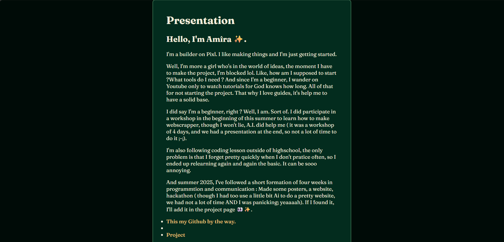
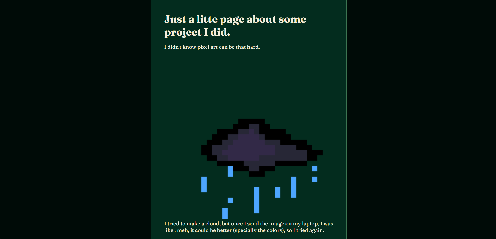

 ###### Huh, know that english isn't my first languages (and it is my fist readme lol), so I'll try my best.
# Builderpage
 The project **"Builder page"** is a website made for the YSWS (You Ship We Ship) 'Pixl'. The purpose behind it is just to present myself and some project I did too accomplish my frist trial ​✨. 

It has two pages (for now) :

- The first one is presenting me and the previous experiencs I have in programming.
 

- 
And the second one shows the few project I did.

For the project I've showed, I used Pixel Studio on my phone, and for the 3D project, I used Blender ( because it's free hehe).

I've used :
 - The 'HTML guide' and 'Your first site, line by line' in the Pixl Doc.
 - HTML and CSS language for the website.
 - And for the police, I've take it from Google Font : [Fraunces](https://fonts.google.com/specimen/Fraunces?preview.script=Latn&preview.lang=fr_Latn).

I've decided to go with a green vibe for the color of the website because why not ?
##### More seriously, it's one of my favorites colors.

To see the website, just click on the link [here](https://aaa-like-the-batterie.github.io/builderpage/) 
